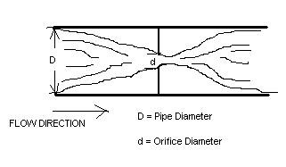
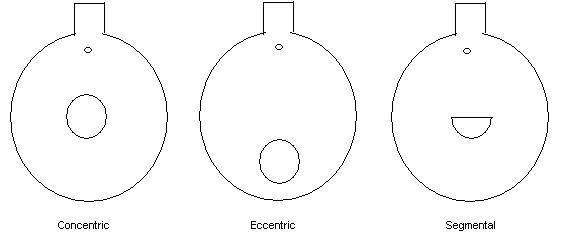

### Theory

**Orifice meter** is type of variable head meter. In this meter the obstruction to the flow consist of an engineering constriction in the metered fluid which causes a reduction in the flow pressure. An orifice meter is a conduit and a restriction to create a pressure drop. It uses the same principle as a Venturi nozzle, namely Bernoulli's principle which states that there is a relationship between the pressure of the fluid and the velocity of the fluid. When the velocity increases, the pressure decreases and vice versa. An orifice plate is a thin plate with a hole in the center of the plate. It is usually placed in a pipe in such a way that fluid passed through the hole. When the fluid reaches the orifice plate, with the hole in the middle, the fluid is forced to converge to go through the small hole; the point of maximum convergence actually occurs shortly downstream of the physical orifice, at the so-called vena contracta . Vena contracta is a point where the velocity and the pressure changes. Beyond the vena contracta, the fluid expands and the velocity and pressure change once again. By measuring the difference in fluid pressure between the normal pipe section and at the vena contracta, the volumetric and mass flow rates can be obtained from Bernoulli's equation.There are different types of orifice plate that are namely Concentric, Segmental, Eccentric and Quadrant Edge and Conic Edge.

In order to use any of these devices for measurement it is necessary to empirically calibrate them. That is, pass a known volume through the meter and note the reading in order to provide a standard for measuring other quantities. Due to the ease of duplicating and the simple construction, the thin sharp edged orifice has been adopted as a standard and extensive calibration work has been done so that it is widely accepted as a standard means of measuring fluids. Provided the standard mechanics of construction are followed no further calibration is required. An orifice in a pipeline with a manometer for measuring the drop in pressure (differential) as the fluid passes through the orifice. The minimum cross sectional area of the jet is known as the “vena contracta” where the velocity is maximum and static pressure is minimum. It is observed at some distance from orifice because of inertia effects persisting in flow direction. Materials used for orifice plate are mild steel, stainless steel, phosphor bronze and gun metal.

